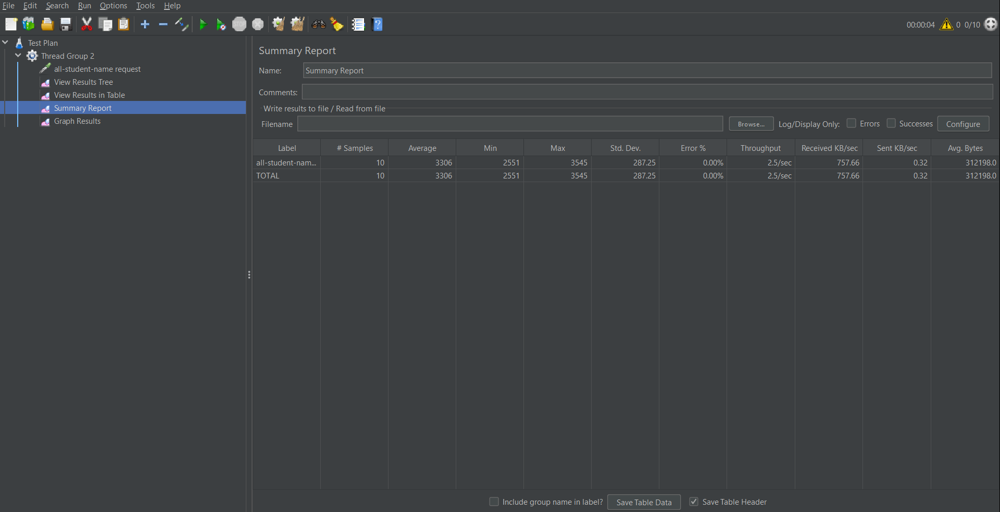
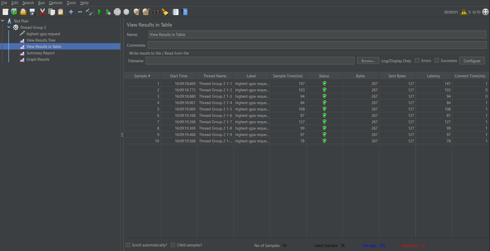
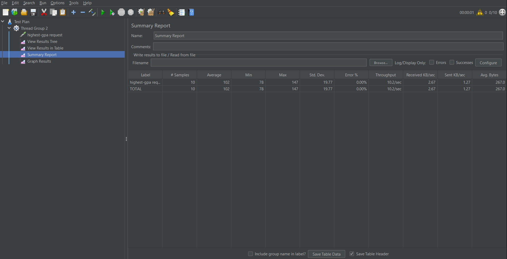
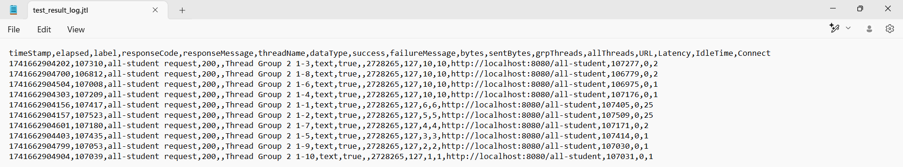
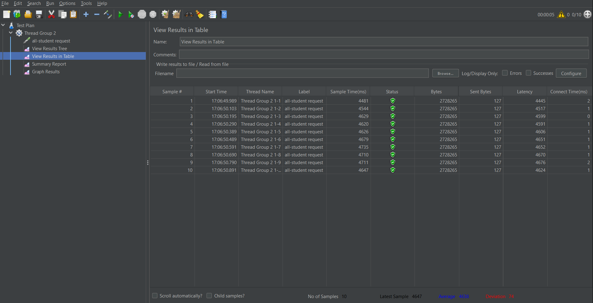
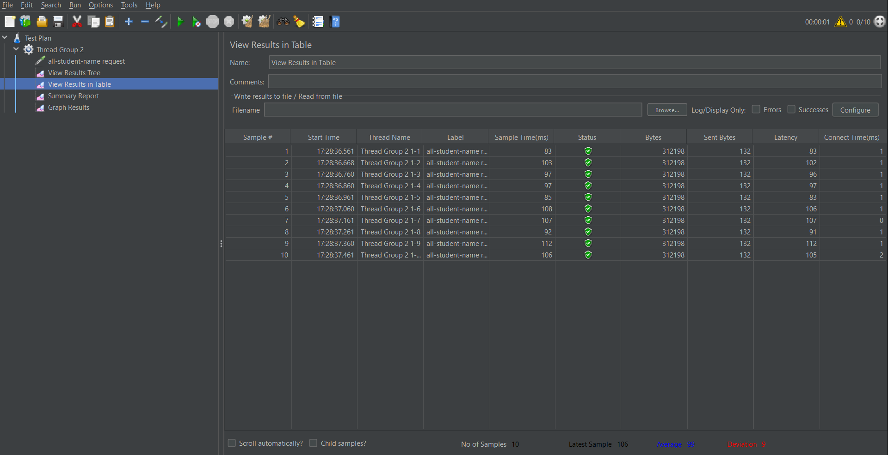
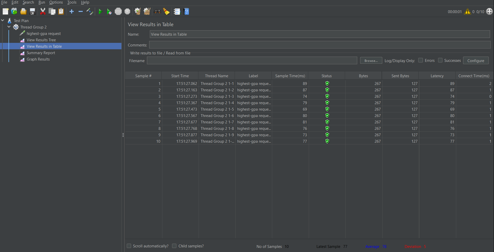
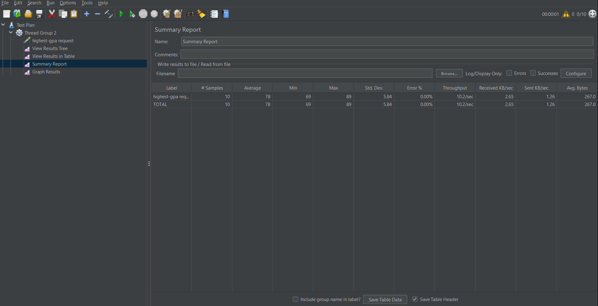

# Advprog Java Profiling
**Nama:**   &nbsp; Stefanus Tan Jaya 
**NPM:**    &nbsp;&ensp; 2306152456 
**Kelas:**  &nbsp; Pemrograman Lanjut A 

### JMeter GUI Results (before profiling)
* **all-student**

* **all-student-name**

* **highest-gpa**

### JMeter CMD Results (before profiling)
* **all-student**

* **all-student-name**

* **highest-gpa**

### JMeter GUI Results (after profiling)
* **all-student**

* **all-student-name**

* **highest-gpa**

### Conclusion
Setelah melakukan *refactor profiling*, waktu yang dibutuhkan untuk menjalankan *request* tersebut mengalami penurunan. Pada pengujian dengan menggunakan JMeter, `/all-student` mengalami peningkatan performa yang cukup signifikan, yang awalnya rata-rata *runtime*-nya 111006 ms menjadi 4638 ms (sekitar 95% peningkatan). Hal yang sama juga berlaku pada `/all-student-name` dari 3306 ms turun menjadi 99 ms (sekitar 97% peningkatan). Untuk `/highest-gpa` juga mengalami peningkatan performa walau tidak signifikan, yaitu dari 102 ms menjadi 78 ms (sekitar 23% peningkatan).

### Reflection
1. **What is the difference between the approach of performance testing with JMeter and profiling with IntelliJ Profiler in the context of optimizing application performance?** 
    Pengujian dengan JMeter lebih mengarah ke pandangan pengguna, di mana fungsinya untuk tes performa *website* di bawah *load* sejumlah *user*. Sementara itu, pengujian dengan IntelliJ Profiler lebih mengarah ke pandangan *developer*, di mana fungsinya untuk membantu analisis performa kode-kode, termasuk beban dan kecepatan *method* dan *class*.  
2. **How does the profiling process help you in identifying and understanding the weak points in your application?** 
    Dengan *profiling*, saya dapat mengetahui titik lemah dari kode saya karena *profiling* memberikan rincian mengenai performa dan beban dari tiap *method* dan *class* yang bersangkutan dari tes yang dijalankan. Dengan demikian, saya dapat mengidentifikasi *method* dan *class* yang paling banyak memakan waktu dan memori untuk dioptimisasikan.   
3. **Do you think IntelliJ Profiler is effective in assisting you to analyze and identify bottlenecks in your application code?**  
    Bagi saya, IntelliJ Profiler cukup membantu dalam menganalisis dan mengidentifikasi *bottleneck* dalam kode saya. Fungsinya yang memberikan rincian mengenai performa dan beban *method* dan *class* dengan jelas menunjukkan titik lemah kode yang harus saya perbaiki dan optimisasi.  
4. **What are the main challenges you face when conducting performance testing and profiling, and how do you overcome these challenges?**  
    Tantangan utamanya adalah saat membaca dan memahami hasil tes yang keluar. Informasi yang saya terima cukup banyak, sehingga  saya butuh waktu lebih untuk membaca tes lebih teliti dan memahaminya. Tujuannya supaya saya dapat menggunakan optimisasi yang sesuai dan membandingkan perubahan performanya.  
5. **What are the main benefits you gain from using IntelliJ Profiler for profiling your application code?** 
    Keuntungan utama yang saya dapatkan adalah dapat lebih mudah mengidentifikasi titik lemah yang ada pada kode saya, sehingga saya bisa mengoptimisasikannya.  
6. **How do you handle situations where the results from profiling with IntelliJ Profiler are not entirely consistent with findings from performance testing using JMeter?** 
    Sejujurnya, saya tidak mengalami itu saat mengerjakan *exercise* ini. Namun, saya rasa cara menanganinya adalah menganalisis perbedaan yang muncul dan kode yang bersangkutan. Bila saya mengalami kebuntuan, saya bisa menanyakan masalah tersebut ke teman saya atau mencarinya dari sumber luar.  
7. **What strategies do you implement in optimizing application code after analyzing results from performance testing and profiling? How do you ensure the changes you make do not affect the application's functionality?** 
    Supaya perubahan yang dibuat tidak memengaruhi fungsionalitas aplikasi, saya rasa bisa mengimplementasikan *test driven development* (TDD) saat melakukan *refactoring*. Tujuannya sama seperti saat mengerjakan modul 4 kemarin di mana kode dibangun dari tes-tes yang dijalankan.